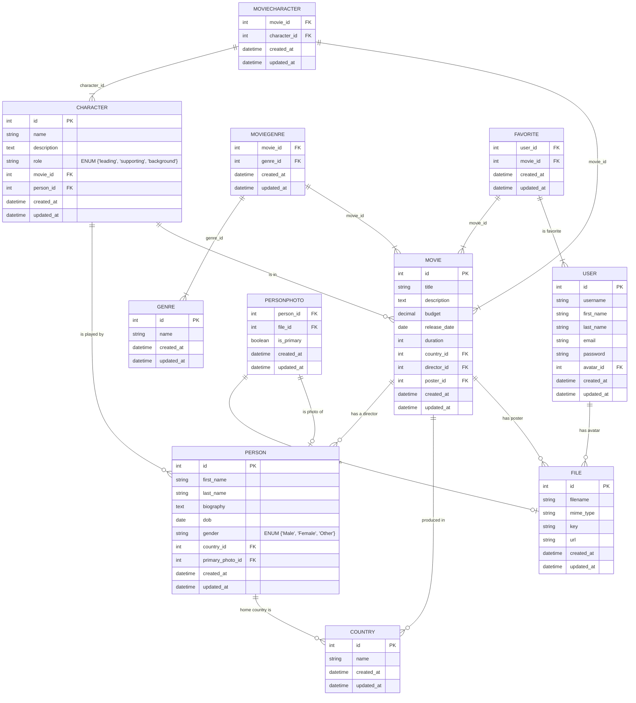

# DB for a movie application

```mermaid
    erDiagram
    USER {
        int id PK
        string username
        string first_name
        string last_name
        string email
        string password
        int avatar_id FK
        datetime created_at
        datetime updated_at
    }

    FILE {
        int id PK
        string filename
        string mime_type
        string key
        string url
        datetime created_at
        datetime updated_at
    }

    COUNTRY {
        int id PK
        string name
        datetime created_at
        datetime updated_at
    }

    GENRE {
        int id PK
        string name
        datetime created_at
        datetime updated_at
    }

    PERSON {
        int id PK
        string first_name
        string last_name
        text biography
        date dob
        string gender "ENUM {'Male', 'Female', 'Other'}"
        int country_id FK
        int primary_photo_id FK
        datetime created_at
        datetime updated_at
    }

    PERSONPHOTO {
        int person_id FK
        int file_id FK
        boolean is_primary
        datetime created_at
        datetime updated_at
    }

    MOVIE {
        int id PK
        string title
        text description
        decimal budget
        date release_date
        int duration
        int country_id FK
        int director_id FK
        int poster_id FK
        datetime created_at
        datetime updated_at
    }

    CHARACTER {
        int id PK
        string name
        text description
        string role "ENUM {'leading', 'supporting', 'background'}"
        int movie_id FK
        int person_id FK
        datetime created_at
        datetime updated_at
    }

    MOVIECHARACTER {
        int movie_id FK
        int character_id FK
        datetime created_at
        datetime updated_at
    }

    MOVIEGENRE {
        int movie_id FK
        int genre_id FK
        datetime created_at
        datetime updated_at
    }

    FAVORITE {
        int user_id FK
        int movie_id FK
        datetime created_at
        datetime updated_at
    }

    USER ||--o{ FILE : "has avatar"
    MOVIE ||--o{ FILE : "has poster"
    MOVIE ||--o{ COUNTRY : "produced in"
    MOVIE ||--o{ PERSON : "has a director"
    PERSONPHOTO ||--o| PERSON : "is photo of"
    PERSONPHOTO ||--o| FILE : "is stored in"
    PERSON ||--o{ COUNTRY : "home country is"
    CHARACTER ||--o{ MOVIE : "is in"
    CHARACTER ||--o{ PERSON : "is played by"
    MOVIECHARACTER ||--|{ MOVIE : movie_id
    MOVIECHARACTER ||--|{ CHARACTER : character_id
    MOVIEGENRE ||--|{ MOVIE : movie_id
    MOVIEGENRE ||--|{ GENRE : genre_id
    FAVORITE ||--|{ USER : "is favorite"
    FAVORITE ||--|{ MOVIE : movie_id
```
